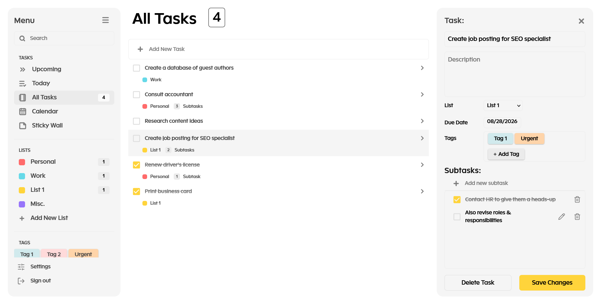

# Task Management Web Application

A full-stack MERN productivity application featuring authenticated multi-user task management, lists, tags, notes, and responsive UI.

## Screenshot



## Live Demo

[Live Application] https://task-manager-webapp-inky.vercel.app/

[Source Code] https://github.com/Tim9675/task-manager-webapp

## Overview

Users can organize work through lists, tags, due dates, and notes, while each account's data is isolated through JWT-based authentication and authorization. The project was built as a portfolio application to demonstrate full-stack software engineering practices.

## Why I built this

I built this project to gain hands-on experience designing and implementing a production-style full-stack application. Rather than focusing only on CRUD functionality, I emphasized code organization, reusable architecture, authentication, validation, testing, and maintainability to better reflect real-world development practices.

## Project Background

This project began as an attempt to build a simple to-do application, a common portfolio project for junior developers. Rather than stopping at basic CRUD functionality, I used it as an opportunity to explore how a production-style full-stack application is designed and implemented.

To accelerate my learning, I referenced both a UI design and a full-stack tutorial during the early stages of development. While these resources influenced the initial direction of the project, the application evolved significantly throughout development. The architecture, authentication system, validation layer, testing strategy, project structure, and many implementation details were redesigned or expanded based on what I learned along the way.

The primary purpose of this project is to demonstrate my understanding of full-stack software engineering concepts rather than to serve as a production SaaS application. As a result, the deployed version may periodically reset user accounts and application data to keep hosting costs manageable.

### Video Reference

https://www.youtube.com/watch?v=F9gB5b4jgOI

### UI Design Reference

https://app.uizard.io/templates/XXJOvmKW0jhEyYZdmA7w/preview

## Features

### Authentication

- Register
- Login
- JWT-based authentication
- Protected routes
- Automatic session restoration

### Task Management

- Create tasks
- Edit tasks
- Delete tasks
- Due date management
- Create and manage subtasks

### Organization

- Create and manage custom lists
- Create and manage custom tags
- Create and manage sticky notes

### Security

- Ownership validation
- Password hashing
- Rate limiting

## Tech Stack

### Frontend

- React
- React Router
- Material UI (MUI)
- Lucide React Icons
- React Hot Toast
- Tailwind CSS / Responsive Layouts

### Backend

- Node.js
- Express.js
- Upstash Redis

### Database

- MongoDB
- Mongoose

### Testing

- Vitest
- React Testing Library

### Deployment

- Vercel
- Render

### Development Workflow

- Git
- GitHub
- VS Code
- Postman
- GitHub Copilot
- ChatGPT

## Architecture

### Frontend

- React Context for global state management
- Custom hooks to encapsulate CRUD logic
- Axios client with centralized authentication and error handling
- Component-based UI architecture

### Backend

- RESTful API architecture
- Layered MVC-inspired architecture
- Request validation layer
- Authentication and authorization middleware
- MongoDB data models using Mongoose

## Folder Structure

```text
project-root/
└── client/
    ├── public/
    └── src/
        ├── api/
        ├── assets/
        ├── components/
        ├── contexts/
        ├── layouts/
        ├── pages/
        ├── routes/
        ├── tests/
        ├── utils/
        ├── App.jsx
        ├── index.css
        └── main.jsx
    ├── .env
    ├── index.html
    ├── package-lock.json
    ├── package.json
    └── vite.config.js
└── server/
    └── src/
        ├── config/
        ├── controllers/
        ├── middleware/
        ├── models/
        ├── routes/
        ├── tests/
        ├── utils/
        ├── validation/
        ├── app.js
        └── server.js
    ├── .env
    ├── package-lock.json
    └── package.json
.gitignore
LICENSE
README.md
```

## Installation

### 1. Clone the repository

```bash
git clone <repository-url>
```

### 2. Navigate into the project folder

```bash
cd <project-folder>
```

### 3. Install frontend dependencies

```bash
cd client
npm install
```

### 4. Install backend dependencies

```bash
cd server
npm install
```

## Environment Variables

For local development, create the following .env files. Production environment variables are configured directly through the respective hosting platforms.

### Frontend

Create a `.env` file inside the client directory.

Example:

```env
VITE_API_URL=http://localhost:5001/api
```

### Backend

Create a `.env` file inside the server directory.

Example:

```env
MONGO_URI=your_mongodb_connection_string

PORT=5001

UPSTASH_REDIS_REST_URL=your_upstashredis_url
UPSTASH_REDIS_REST_TOKEN=your_upstashredis_token

JWT_SECRET_KEY=your_jwt_key

CLIENT_URL=http://localhost:5173
```

## Running the Project

### Start the backend

Inside the server directory:

```bash
npm run dev
```

### Start the frontend

Inside the client directory:

```bash
npm run dev
```

## Testing

### Frontend

Unit/component testing using Vitest and React Testing Library.

Inside the client directory:

```bash
npm test
```

### Backend

Validation, controller, middleware, and integration tests using Vitest.

Inside the server directory:

```bash
npm test
```

## Deployment

The frontend is deployed on Vercel and the backend is deployed on Render.

- Frontend: Vercel
- Backend: Render
- Database: MongoDB Atlas
- Rate limiting: Upstash Redis

## Design Decisions

- React Context is used to manage application state.
- CRUD operations are encapsulated in reusable custom hooks to reduce duplication across providers.
- API calls are isolated behind an API layer.
- Backend validation is separated from controllers.
- JWT authentication is handled through middleware.
- Every resource is ownership-validated to prevent unauthorized access to another user's data.
- Rate limiting is implemented using Upstash Redis.

## Lessons Learned

- Designing reusable React Context providers and custom hooks
- Handling JavaScript date normalization across time zones
- Structuring Express middleware for authentication, validation, and error handling
- Protecting both frontend routes and backend resources
- Writing unit and integration tests with Vitest
- Separating business logic from controllers to improve maintainability

## Future Improvements

- Mobile responsive design
- Dark Mode
- Dedicated 404 not found page
- Calendar view with events
- Recurring tasks
- CI/CD

# Author

Developed by Timothy Magno.

Aspiring Full-Stack / Software Developer.

Email: tmmagno9675@gmail.com

LinkedIn: https://www.linkedin.com/in/timothy-john-magno/
